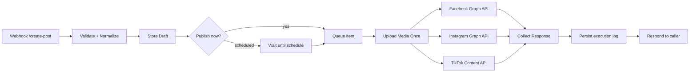
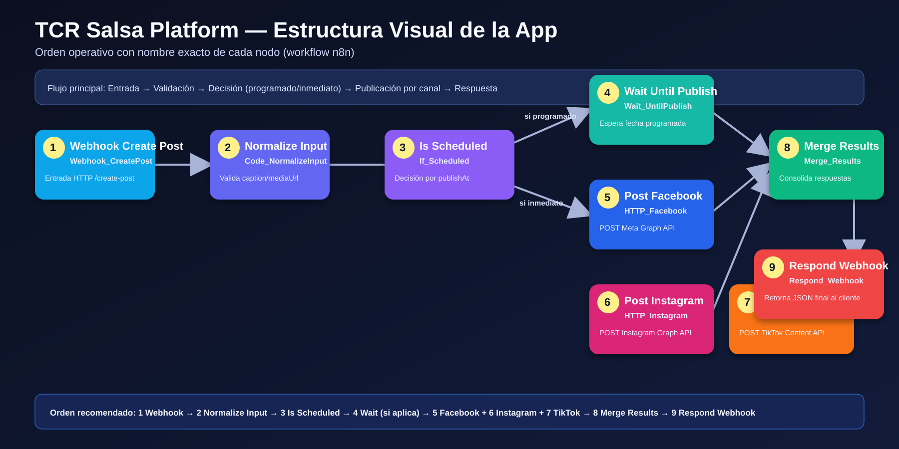

# TCR Salsa Network — flujo coherente para app de publicación social

Este documento propone un flujo de n8n que funciona como app backend para
publicar contenido de manera consistente en TikTok, Facebook e Instagram,
respetando APIs oficiales y evitando scraping inestable.

## Objetivo

1. Recibir un post desde webhook (texto, imagen/video, fecha).
2. Normalizar los campos.
3. Guardar en una cola (Google Sheets o DB).
4. Publicar por canal con credenciales separadas.
5. Guardar resultado y errores por plataforma.

## Arquitectura recomendada



## Infografía visual (a colores)

> Orden importante de nodos y nombres exactos para que puedas seguir la plataforma como app.



Secuencia clave:

1. **Webhook Create Post** (`Webhook_CreatePost`)
2. **Normalize Input** (`Code_NormalizeInput`)
3. **Is Scheduled** (`If_Scheduled`)
4. **Wait Until Publish** (`Wait_UntilPublish`) *si `publishAt` está en el futuro*
5. **Post Facebook** (`HTTP_Facebook`)
6. **Post Instagram** (`HTTP_Instagram`)
7. **Post TikTok** (`HTTP_TikTok`)
8. **Merge Results** (`Merge_Results`)
9. **Respond Webhook** (`Respond_Webhook`)

## Nodos clave en n8n

- `Webhook` para endpoint de entrada.
- `Code` para validación simple de payload.
- `If` para separar publicación inmediata vs programada.
- `Wait` para fecha programada.
- `HTTP Request` por cada plataforma:
  - Facebook Graph API (página)
  - Instagram Graph API (cuenta business/creator vinculada)
  - TikTok Content Posting API
- `Merge` y `Set` para respuesta unificada.
- `Data Store` o Google Sheets para auditoría.

## Contrato de entrada sugerido

```json
{
  "title": "Nuevo video en vivo",
  "caption": "Hoy salsa desde Puerto Rico",
  "mediaUrl": "https://cdn.example.com/video.mp4",
  "publishAt": "2026-04-19T18:00:00Z",
  "platforms": ["facebook", "instagram", "tiktok"],
  "tags": ["salsa", "puertorico", "live"]
}
```

## Buenas prácticas

1. Mantener tokens por plataforma en credenciales de n8n, no en nodos.
2. Aplicar retries y manejo de rate limits por API.
3. Guardar `platformPostId`, `status`, `errorCode`, `errorMessage`.
4. No usar endpoints no oficiales para TikTok/Meta.
5. Añadir alertas (Slack/Email) para fallos de publicación.

## Archivo de plantilla

La plantilla inicial del flujo se incluye en:

- `docs/workflows/tcr-salsa-social-publisher.json`

Puedes importarla en n8n y ajustar IDs, tokens y endpoints reales de tu cuenta.
